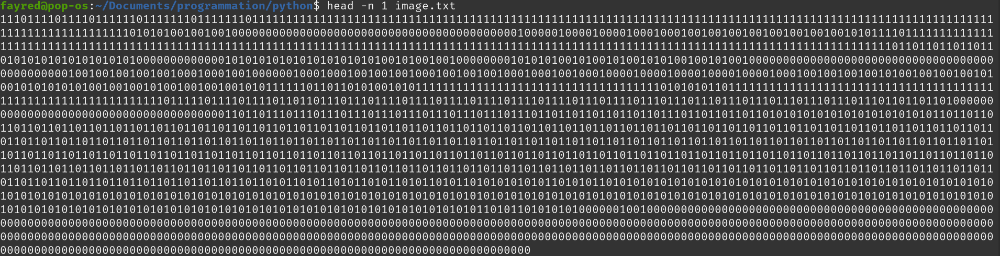
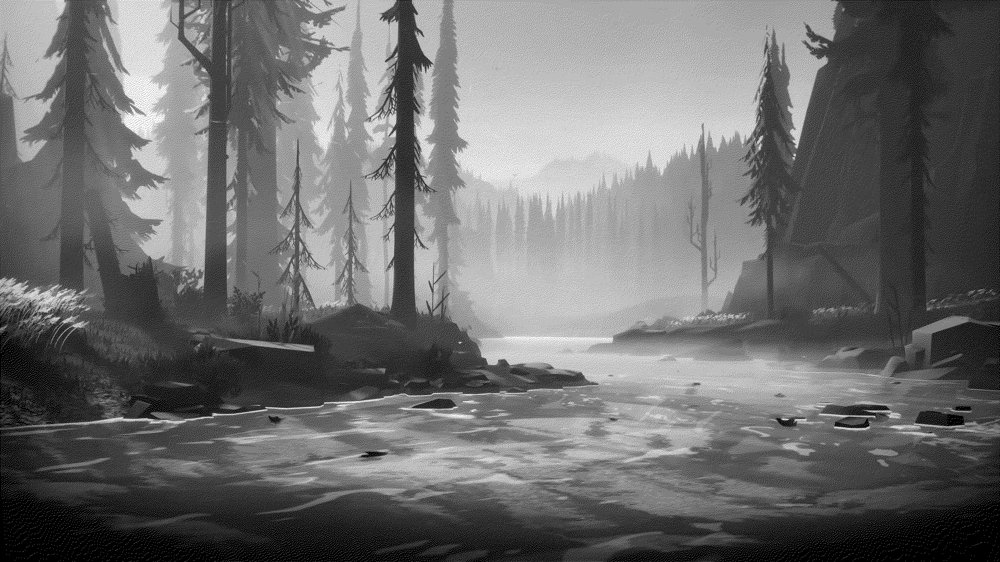

# pixDecomp.py

(decompose image to black and white )

-----

### How decompose an image with ?


```bash
$ python3 pixDecomp.py -d -i image.png -f image.txt
```



----

### How recompose image with ?


```bash
$ python3 pixDecomp.py -c -i image2.png -f image.txt
```


